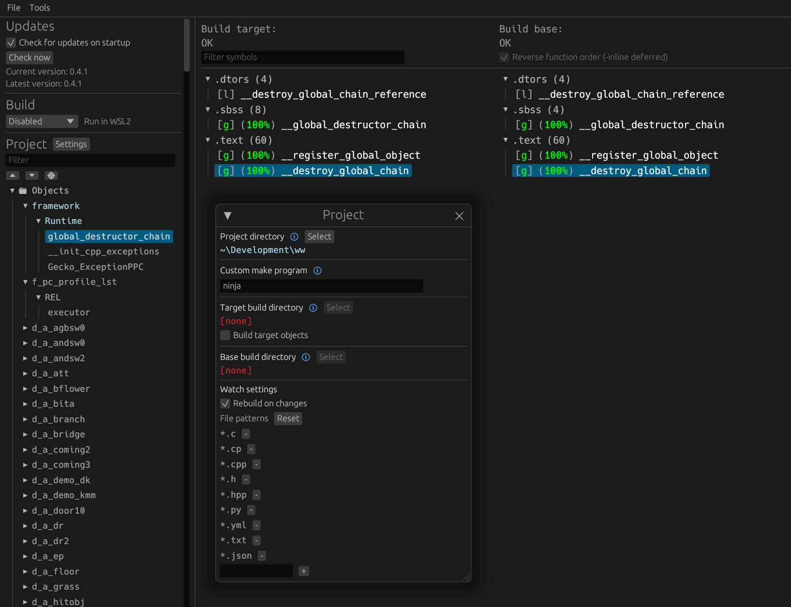

Final Fantasy Crystal Chronicles Decompilation
[![Build Status]][actions] [![Progress]][progress site] [![DOL Progress]][progress site]
===============================
[Build Status]: https://github.com/zcanann/FFCC-Decomp/actions/workflows/build.yml/badge.svg
[actions]: https://github.com/zcanann/FFCC-Decomp/actions/workflows/build.yml
[Progress]: https://decomp.dev/zcanann/FFCC-Decomp.svg?mode=shield&measure=code&label=Code&category=all
[progress site]: https://decomp.dev/zcanann/FFCC-Decomp
This is the decompilation for Final Fantasy Crystal Chronicles for the Nintendo GameCube.

There are 3 versions of this game: JP, EN, and PAL (EU).

Fortunately, the EN build contains a debug symbol file, and the PAL version contains a release symbol file (although for a different build). These have greatly simplified the decompilation process for FFCC. These symbols allowed us to recover exact function and class names, as well as all parameters to each function, and class hierarchies.

**⚠️ Assets are not bundled with this repository. You must obtain these on your own. ⚠️**

# Contribution Guide

## Beginners Contribution Guide
The most direct way to contribute with minimal setup is to pick any non-perfect section from [the decomp tracker](https://decomp.dev/zcanann/FFCC-Decomp), then improve overall progress (code match, data match, or linkage).

Refer to the sections on building and diffing. Once set up, modify `.cpp`/`.h` files and, when needed, `configure.py` flags to improve output.

Small regressions can be acceptable when outweighed by larger gains in another category (for example, a minor code-byte loss with substantial data or linkage progress).

If progress appears stuck at 0% for a unit/function, check linkage and declarations first. Common symptoms include unexpected Metrowerks mangled names, improper linkage (using `extern "C"` when uneeded, or missing it when needed), or missing special pragmas. That said, bias towards simplicity unless proven otherwise is necessary.

Avoid leaving hardcoded offset-based member access (for example `(this + 0x28)`) in final contributions. Prefer proper types and named data members, even if the offset form currently matches.

## Advanced Contribution Guide
For experienced reverse-engineers, there are still quite a few harder tasks remaining.

### EN & JPN Versions

The EN & JPN versions are deliberately being left for last. However, if someone wishes to begin this effort early, this is more than welcome.

# Dependencies

## Windows

On Windows, it's **highly recommended** to use native tooling. WSL or msys2 are **not** required.  
When running under WSL, [objdiff](#diffing) is unable to get filesystem notifications for automatic rebuilds.

- Install [Python](https://www.python.org/downloads/) and add it to `%PATH%`.
  - Also available from the [Windows Store](https://apps.microsoft.com/store/detail/python-311/9NRWMJP3717K).
- Download [ninja](https://github.com/ninja-build/ninja/releases) and add it to `%PATH%`.
  - Quick install via pip: `pip install ninja`

## macOS

- Install [ninja](https://github.com/ninja-build/ninja/wiki/Pre-built-Ninja-packages):

  ```sh
  brew install ninja
  ```

[wibo](https://github.com/decompals/wibo), a minimal 32-bit Windows binary wrapper, will be automatically downloaded and used.

## Linux

- Install [ninja](https://github.com/ninja-build/ninja/wiki/Pre-built-Ninja-packages).

[wibo](https://github.com/decompals/wibo), a minimal 32-bit Windows binary wrapper, will be automatically downloaded and used.

## Building

- Clone the repository:

  ```sh
  git clone https://github.com/my/repo.git
  ```

- Copy your game's disc image to `orig/GAMEID`.
  - Supported formats: ISO (GCM), RVZ, WIA, WBFS, CISO, NFS, GCZ, TGC
  - After the initial build, the disc image can be deleted to save space.

- Configure:

  ```sh
  python configure.py
  ```

  To use a version other than `GAMEID` (USA), specify it with `--version`.

- Build:

  ```sh
  ninja
  ```

## Diffing

Once the initial build succeeds, an `objdiff.json` should exist in the project root.

Download the latest release from [encounter/objdiff](https://github.com/encounter/objdiff). Under project settings, set `Project directory`. The configuration should be loaded automatically.

Select an object from the left sidebar to begin diffing. Changes to the project will rebuild automatically: changes to source files, headers, `configure.py`, `splits.txt` or `symbols.txt`.


