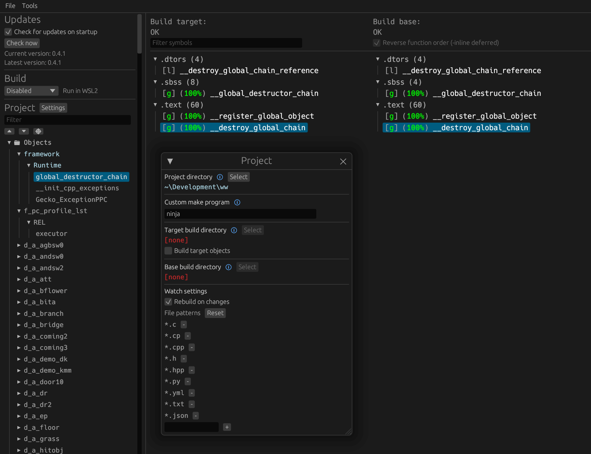

Final Fantasy Crystal Chronicles Decompilation
[![Build Status]][actions] [![Progress]][progress site]
===============================
[Build Status]: https://github.com/zcanann/FFCC-Decomp/actions/workflows/build.yml/badge.svg
[actions]: https://github.com/zcanann/FFCC-Decomp/actions/workflows/build.yml
[Progress]: https://decomp.dev/zcanann/FFCC-Decomp.svg?mode=shield&measure=code&label=Code&category=all
[progress site]: https://decomp.dev/zcanann/FFCC-Decomp
This is the decompilation for Final Fantasy Crystal Chronicles for the Nintendo GameCube.

There are 3 versions of this game: JP, EN, and PAL (EU).

Fortunately, the EN build contains a debug symbol file, and the PAL version contains a release symbol file (although for a different build). These have greatly simplified the decompilation process for FFCC. These symbols allowed us to recover exact function and class names, as well as all parameters to each function, and class hierarchies.

**⚠️ Assets are not bundled with this repository. You must obtain these on your own. ⚠️**

# Contribution Guide

## Beginners Contribution Guide
The most direct way to contribute with minimal setup is to pick any non-perfect section from [the decomp tracker](https://decomp.dev/zcanann/FFCC-Decomp), then improve overall progress (code match, data match, or linkage).

Refer to the sections on building and diffing. Once set up, modify `.cpp`/`.h` files and, when needed, `configure.py` flags to improve output.

Small regressions can be acceptable when outweighed by larger gains in another category (for example, a minor code-byte loss with substantial data or linkage progress).

If progress appears stuck at 0% for a unit/function, check linkage and declarations first. Common symptoms include unexpected Metrowerks mangled names, improper linkage (using `extern "C"` when uneeded, or missing it when needed), or missing special pragmas. That said, bias towards simplicity unless proven otherwise is necessary.

Avoid leaving hardcoded offset-based member access (for example `(this + 0x28)`) in final contributions. Prefer proper types and named data members, even if the offset form currently matches.

## Advanced Contribution Guide
For experienced reverse-engineers, there are still quite a few harder tasks remaining.

### Regional builds

PAL, USA and Japan build from shared source with separate retail inputs, symbol
configs, output directories and matching claims. PAL remains the primary target
with the most mature matching and linkage. USA and Japan have partial recovered
configs and retain retail objects for unproven units. A passing retail checksum
with those fallbacks does not mean that the region is fully decompiled.

Changes to shared source or build tooling must compile all configured source and
verify the GameCube executable and both GBA images for all three regions. See
[the GBA guide](gba/README.md) and [CI documentation](docs/github_actions.md).

# Dependencies

## Windows

On Windows, it's **highly recommended** to use native tooling. WSL or msys2 are **not** required.  
When running under WSL, [objdiff](#diffing) is unable to get filesystem notifications for automatic rebuilds.

- Install [Python](https://www.python.org/downloads/) and add it to `%PATH%`.
  - Also available from the [Windows Store](https://apps.microsoft.com/store/detail/python-311/9NRWMJP3717K).
- Download [ninja](https://github.com/ninja-build/ninja/releases) and add it to `%PATH%`.
  - Quick install via pip: `pip install ninja`

## macOS

- Install [ninja](https://github.com/ninja-build/ninja/wiki/Pre-built-Ninja-packages):

  ```sh
  brew install ninja
  ```

[wibo](https://github.com/decompals/wibo), a minimal 32-bit Windows binary wrapper, will be automatically downloaded and used.

## Linux

- Install [ninja](https://github.com/ninja-build/ninja/wiki/Pre-built-Ninja-packages).

[wibo](https://github.com/decompals/wibo), a minimal 32-bit Windows binary wrapper, will be automatically downloaded and used.

## Building

- Clone the repository:

  ```sh
  git clone https://github.com/zcanann/FFCC-Decomp.git
  ```

- Supply the retail inputs for each region you want to build:

  | Region | Version | Disc image under `orig/<version>/` |
  |---|---|---|
  | PAL (default) | `GCCP01` | `FFCC_PAL.iso` |
  | USA | `GCCE01` | `FFCC_USA.gcm` |
  | Japan | `GCCJGC` | `FFCC_JP.iso` |

  The GameCube build can also read disc formats supported by decomp-toolkit,
  including RVZ. The GBA extractor reads the ISO/GCM files named above. For an
  extracted-only build, supply `orig/<version>/sys/main.dol` and both
  `orig/<version>/gba/ffcc_cli.bin` and `orig/<version>/gba/mgr00.bin`.
  Existing extracted GBA inputs are used without modifying them. Each region's
  inputs are checked against its own expected hashes.

- Install the GBA dependencies and pinned compilers described in
  [gba/README.md](gba/README.md). They are required to include GBA source in
  validation and progress.

- Configure and build the selected region, for example PAL:

  ```sh
  python configure.py --version GCCP01
  ninja all_source progress build/GCCP01/report.json
  ```

  Use `GCCE01` or `GCCJGC` in both commands for another region. Outputs are kept
  under `build/<version>/`; the root `build.ninja` and `objdiff.json` describe
  the most recently configured region. Use separate worktrees for simultaneous
  regional builds. The compiler tools are shared across regions.

  `all_source` compiles configured source, including GameCube units not yet
  mapped into the selected region's splits. `progress` verifies the linked
  GameCube executable and both GBA images, then generates the report. Shared
  changes require all three regional builds: three DOL and six GBA checksum
  checks, plus source compilation. Match and linkage claims remain independent
  for each region.

## Diffing

Once the initial build succeeds, an `objdiff.json` should exist in the project root.

Download the latest release from [encounter/objdiff](https://github.com/encounter/objdiff). Under project settings, set `Project directory`. The configuration should be loaded automatically.

Select an object from the left sidebar to begin diffing. Changes to the project will rebuild automatically: changes to source files, headers, `configure.py`, `splits.txt` or `symbols.txt`.



### Finding function-order candidates

After building, scan existing game objects for function-order differences:

```sh
python tools/mine_function_order.py --limit 20 --json build/function_order_candidates.json
python tools/mine_function_order.py --unit main/p_light --details
```

The report compares retail split objects with compiled objects, computes a minimal set of function moves, and prioritizes small candidates without missing functions or size differences. It reads existing builds and does not edit sources. `--diff-json` can analyze a saved objdiff diff.

Moves describe **compiled order**: deferred compilation can reverse source order. Generated special members are flagged for review; constant-pool layout requires separate investigation. These are candidates, not guaranteed byte gains. After changing a candidate, rebuild and compare the whole unit with objdiff before committing.
